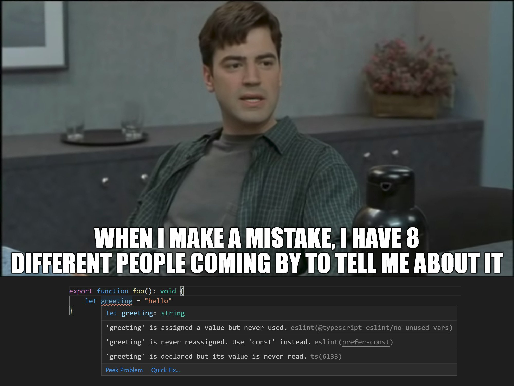
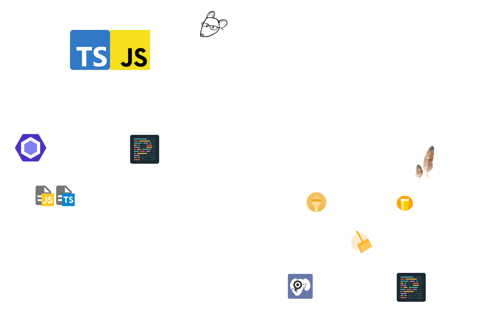

## hello vvworld

# Prettier & ESLint

<v-click>& .editorconfig, .jsconfig, …</v-click>

<small v-click>& Pint, Duster, PHP CS Fixer, …</small>

---
layout: section
---

# Was erwartet euch heute?

<v-clicks>

- Grundlagen: Formatting, Linting, … — _die Terminologie verstehen_
- Überblick über das Ökosystem — _die Tools kennen_
- Grundlegendes Setup und How-To der wichtigsten Tools
  - Extensions
  - Config Dateien
  - CLI Befehle
- Die Tools souverän nutzen — _sich nicht ärgern lassen_

</v-clicks>

<!--
Gerne jederzeit unterbrechen, Fragen stellen, Pausen machen, …
-->

---
layout: statement
---

# Formatting/Linting ist das IaC für die Codequalität

---
layout: section
image: https://source.unsplash.com/collection/94734566/1920x1080
---

# Grundlagen

---
layout: two-cols-header
---

# Was macht Formatting?

- Automatische Anpassung der Code-Struktur nach vordefinierten Regeln
- Einheitliches Erscheinungsbild des Codes sicherstellen
- Änderung von Whitespace, Zeilenumbrüchen, Einrückungen, Kommasetzung etc.

::left::

<v-click>

## Vorher

```php
<?   php

echo     'Bad!'   ;

if        (    $bad){
echo "Bad";
       }
```

</v-click>

::right::

<v-click>

## Nachher

```php
<?php

echo 'Less bad!';

if ($lessBad) {
    echo 'Less bad';
}
```

</v-click>

---
layout: two-cols-header
---

# Was macht Linting?

- Statische Code-Analyse zur Identifikation problematischer Muster
- Logische Fehler, Bugs vor der Ausführung finden
- Tools scannen Code ohne Ausführung und warnen bei Problemen

::left::

<v-click>

```js
const a = 0;

a = 1; // Error: `a` is read-only
```

</v-click>

<v-click >

```js
if (a) {
  foo();
} else if (b) {
  bar();
  // This branch can never execute.
  // Its condition is a duplicate or covered
  // by previous conditions in the if-else-if chain.
} else if (b) {
  baz();
}
```

</v-click>

::right::

<v-click>

## Vorher

```php
$value = 'hello vvworld!';

return view('view', compact('value'));
```

</v-click>

<v-click>

## Nachher

```php
return view('view', ['value' => 'hello vvworld!']);
```

</v-click>

---
layout: bullets
---

# Formatting vs. Linting

<v-clicks>

| **Formatting**                   | **Linting**                                                     |
| -------------------------------- | --------------------------------------------------------------- |
| Syntax & Darstellung             | Semantik & Best Practices                                       |
| Automatische Formatierung        | Problemerkennung & teilweise Behebung                           |
| Oberflächliche Strukturanalyse   | Tiefes Verständnis von Code-Logik <br> <u>Statische Analyse</u> |
| Keine Erkennung von Logikfehlern | Findet Bugs und problematische Muster                           |
| Schnell und ressourcenschonend   | Rechenintensiver durch komplexere Analyse                       |

</v-clicks>

---
layout: bullets
---

# Statische vs. Dynamische Analyse

<v-clicks>

| **Statisch**                             | **Dynamisch**                                |
| ---------------------------------------- | -------------------------------------------- |
| Prüft ohne Ausführung                    | Prüft während der Laufzeit                   |
| Findet: Syntaxfehler, Stilverstöße, Bugs | Findet: Laufzeitfehler, Performance-Probleme |
| Schnell, im Editor oder CI               | Braucht echte Eingaben oder Tests            |
| Beispiele: ESLint, TypeScript            | Beispiele: Profiler, Debugger, Tests         |

</v-clicks>

---
layout: two-cols-header-footer
---

# Abstract Syntax Tree

- Beide Toolgruppen verwenden üblicherweise einen AST
- Viele Tools mach(t)en deswegen sowohl Linting als auch Formatting

::left::

## Code

```php
<?php

echo "hello vvworld!";
```

::right::

## AST (vereinfacht)

<div class="code-sm">

```json
{
  "kind": "program",
  "children": [
    {
      "expressions": [
        {
          "kind": "string",
          "raw": "\"hello vvworld!\"",
          "isDoubleQuote": true
        }
      ]
    }
  ]
}
```

</div>

::bottom::

https://astexplorer.net/

---
src: ./tool-landscape.md
---

layout: bullets

---
layout: bullets
---

# Uff …

---
layout: statement
---

# It's not about looks

oder: Das _Wie_ ist Nebensache

---
layout: bullets
---

# Worum geht es dann?

> "Our top reason was to stop wasting our time debating style nits."
>
> _prettier.io_

> "Prettier determines our code style. While Prettier's output isn't always the prettiest, it's consistent and removes all (meaningless) discussion about code style."
>
> _spatie.be_

> You can avoid discussions like "should I be using tabs or spaces?" and "does the curly brace go at the end of the line or on the next line?"
>
> _vicvijayakumar.com_

---
layout: bullets
---

# Was wir davon haben

<v-clicks>

- Fokus auf Logik statt Formatierung – _Konzentration auf das Wesentliche_
- Lesbarere Merge Requests – _das wichtige auf einen Blick_
- Effizientere Pipelines – _kein `fix: linting` mehr_
- Einfacheres Onboarding – _neue Teammitglieder können sofort produktiv sein_
- Als Hilfestellung für Azubis – _so muss das also aussehen_
- Weniger Diskussionen – _lasset die Tools entscheiden!_
- Den Stack meistern – _verstehen, was ist_

</v-clicks>

---
layout: statement
---

# Einfach anfangen

---
layout: three-cols-header
---

# JavaScript

Dazu gehören auch: React, Vue, Svelte, …

::left::

<v-click>

## **Prettier**

Opinionated Formatter für diverse Sprachen

</v-click>

::center::

<v-click>

## **ESLint**

De-facto Standard für JavaScript/TypeScript-Linting

</v-click>

::right::

<v-click>

## **TypeScript Compiler**

Eigenes Typechecking/Linting

</v-click>

---
layout: section
---

# Prettier

---
layout: two-cols-header
---

# Language Support

::left::

- JavaScript/TypeScript
- JSX
- Vue
- CSS, Less, and SCSS
- HTML
- JSON
- GraphQL
- Markdown
- YAML
- ...

::right::

## Offizielle Plugins

Prettier hat viele Plugins für verschiedene Sprachen und Frameworks.

- `prettier-plugin-blade`
- `prettier-plugin-tailwindcss`
- `prettier-plugin-antlers`
- <span v-mark.red.circle>`prettier-plugin-php`</span>
- `prettier-plugin-xml`

---
layout: three-cols-header
---

# Installation im Projekt

::left::

<v-click>

## 1. `.editorconfig`

```ini
root = true

[*]
charset = utf-8
end_of_line = lf
indent_size = 4
indent_style = space
insert_final_newline = true
trim_trailing_whitespace = true

[*.{yaml,yml}]
indent_size = 2

[*.md]
trim_trailing_whitespace = false
```

[editorconfig.org](https://editorconfig.org)

</v-click>

::center::

<v-click>

## 2. Prettier installieren:

```bash
npm install --save-dev prettier
```

</v-click>

<v-click>fertig!</v-click>

<v-click>

nicht ganz …

```bash
npm install --save-dev \
    prettier \
    prettier-plugin-antlers \
    prettier-plugin-tailwindcss
```

</v-click>

::right::

<v-click>

## 3. Prettier konfigurieren

```json
// prettier-ignore
// .prettierrc
{
  "singleQuote": true,
  "printWidth": 120,
  "plugins": [
    "prettier-plugin-antlers",
    "prettier-plugin-tailwindcss"
  ],
  "overrides": [
    {
      "files": ["*.antlers.*"],
      "options": {
        "parser": "antlers"
      }
    }
  ]
}
```

</v-click>

---
layout: two-cols-header
---

# Einrichtung in VSCode

::left::

<div class="flex gap-4 items-center">
    <code>dbaeumer.prettier-vscode</code>
    
</div>

[VSCode Marketplace](https://marketplace.visualstudio.com/items?itemName=esbenp.prettier-vscode)

- <kbd>SHIFT</kbd> + <kbd>OPT</kbd> + <kbd>F</kbd>: `Format Document`
- <kbd>CMD</kbd> + <kbd>Shift</kbd> + <kbd>P</kbd>, `Format: Format Document`
- Optional: `editor.formatOnSave` in VSCode

::right::

```json
// settings.json
{
  "editor.formatOnSave": true,
  "editor.defaultFormatter": "esbenp.prettier-vscode"
}
```

oder:

```json
// settings.json
{
  "[javascript]": {
    "editor.defaultFormatter": "esbenp.prettier-vscode"
  }
}
```

---
layout: two-cols-header
---

# Nutzung in der Pipeline

::left::

## CLI Befehl

```bash
npx prettier [options] [file/dir/glob ...]
```

## Empfehlung

- In der Pipeline nur checken, nicht fixen.
- Pre-Commit-Hook mit `prettier --check`

::right::

## Alles oder einzelne Dateien

```bash
npx prettier . --check
```

```bash
npx prettier examples/example.blade.php --write
```

## Als NPM Script

```bash
npm run format:check
npm run format:fix
```

```json
"scripts": {
  "format:check": "prettier --check .",
  "format:fix": "prettier --write ."
}
```

---
layout: two-cols-header
---

# Prettier ausschalten

::left::

## .prettierignore

```bash
# .prettierignore
**/*.yml
**/*.yaml
**/*.md
/storage
composer.lock
composer.json
package-lock.json
/public/vendor
```

```bash
# einzelne Dateien ignorieren
/examples/example.blade.php
```

https://prettier.io/docs/ignore

::right::

## Ignorieren mit Kommentaren

```js
// prettier-ignore
const matrix = [
  1, 0, 0,
  0, 1, 0,
  0, 0, 1
];
```

```css
/* prettier-ignore */
.my    ugly rule {
}
```

```yaml
# prettier-ignore
key  : value
hello: world
}
```

---

# Antlers 🙁

Im Moment kann Formatierung nur für eine komplette Datei deaktiviert werden.

```liquid
{{#
    @format false
#}}
```

oder `.prettierignore`

```bash
# .prettierignore
resources/views/some-special-code.antlers.html
```

https://github.com/Stillat/vscode-antlers-language-server/issues/104

---
layout: section
---

# ESLint

---
layout: bullets
---

# Was ist ESLint?

- Statisches Analyse-Tool für JavaScript und TypeScript
- Findet und behebt Probleme
- ESLint 8+: neue (Flat) Config, bessere Performance

---
layout: two-cols-header
---

# Installation im Projekt (JavaScript)

::left::

## 1. ESLint installieren:

```bash
npm install --save-dev eslint globals
```

_globals_ sind z.B. `console`, `document`, `fetch`

::right::

## 2. ESLint konfigurieren

<div class="code-sm">

```js
import { includeIgnoreFile } from "@eslint/compat";
import { fileURLToPath } from "node:url";
import { defineConfig } from "eslint/config";
import js from "@eslint/js";
import globals from "globals";

const gitignorePath = fileURLToPath(
  new URL(".gitignore", import.meta.url),
);

export default defineConfig([
  js.configs.recommended,
  includeIgnoreFile(gitignorePath),
  {
    languageOptions: {
      globals: {
        ...globals.browser,
        ...globals.node,
      },
    },
    rules: {
      strict: "error",
      // …
    },
  },
]);
```

</div>

---
layout: two-cols-header-footer
---

# Dateien ignorieren

::left::

## Konfigurationsdatei

Mit `globalIgnores` können Muster global definiert werden.

```js
// eslint.config.js
import { defineConfig, globalIgnores } from "eslint/config";

export default defineConfig([
  {
    ignores: [
      "dist/", // Ignoriert das 'dist' Verzeichnis
      "**/generated-code.js", // Alle Dateien namens 'generated-code.js'
      ".config/*", // Inhalt von '.config'
      "node_modules/*", // Ignoriert alles in node_modules...
      "!node_modules/mylib/", // ...außer 'mylib'
    ],
  },
]);
```

::right::

## CLI (`--ignore-pattern`)

Einzelne Muster können auch direkt beim Aufruf übergeben werden.

```bash
# Verzeichnisse/Dateien ignorieren
npx eslint . --ignore-pattern 'dist/'
npx eslint . --ignore-pattern '*.log'

```

::bottom::

Weitere Details: [eslint.org/docs/latest/use/configure/ignore#ignoring-files](https://eslint.org/docs/latest/use/configure/ignore#ignoring-files)

---
layout: two-cols-header-footer
---

# ESLint-Regeln

`.eslintrc` ist _deprecated_ seit ESLint 9. Ab jetzt wird die Konfiguration in `eslint.config.js` definiert. Die neue Version wird **Flat Config** genannt.

::left::

## Regeln

```js
export default defineConfig([
  js.configs.recommended,
  {
    rules: {
      eqeqeq: "warn",
      camelcase: "1",
    },
  },
]);
```

::right::

## Konfiguration

```js
"off" or 0 // (turn the rule off)
"warn" or 1 // (doesn't affect exit code).
"error" or 2 // (exit code is 1 when triggered).
```

::bottom::

https://eslint.org/docs/latest/rules/

https://github.com/eslint/eslint/blob/main/packages/js/src/configs/eslint-recommended.js

<!--
Flat Config, weil es nur noch eine Datei gibt. Das alte Format erlaubte verschachteln von Konfigurationsdateien in Unterverzeichnissen innerhalb eines Projekts.
-->

---
layout: two-cols-header
---

# Einrichtung in VSCode

::left::

## Installiere die Extension:

<div class="flex gap-4 items-center">
    <code>dbaeumer.vscode-eslint</code>
    
</div>

[VSCode Marketplace](https://marketplace.visualstudio.com/items?itemName=dbaeumer.vscode-eslint)

::right::

## Konfiguration

```json
// settings.json
{
  "editor.codeActionsOnSave": {
    "source.fixAll.eslint": true
  }
}
```

---
layout: two-cols-header
---

# ESLint-Regeln im Code deaktivieren

## _Magische_ Kommentare

::left::

Für eine ganze Datei

```js
/* eslint-disable */
```

```js
/* eslint-disable no-alert */
```

```js
/* eslint no-alert: "off" */
```

<small> Muss am Anfang der Datei stehen </small>

[eslint.org/docs](https://eslint.org/docs/latest/use/configure/rules#disabling-rules)

::right::

Für eine Zeile

```js
const foo = ""; // eslint-disable-line no-unused-vars
```

```js
// eslint-disable-next-line no-alert
alert("foo");
```

Für einen Bereich

```js
/* eslint-disable */
function legacyFunction() {
  // Problematischer Code...
}
/* eslint-enable */
```

---
layout: two-cols-header
---

# Nutzung in der Pipeline

::left::

## CLI Befehl

```bash
npx eslint [options] [file|dir|glob]*
npx eslint . // checken
npx eslint . --fix // fixen
```

::right::

## NPM Script

```json
"scripts": {
    "js-lint:check": "eslint .",
    "js-lint:fix": "eslint . --fix",
}
```

---
layout: two-cols-header-footer
---

# Installation im Projekt (Typescript)

::left::

## 1. Pakete installieren:

```bash
npm install --save-dev eslint \
    @eslint/js \
    typescript \
    typescript-eslint
```

::right::

## 2. ESLint konfigurieren

```js
import js from "@eslint/js";
import tseslint from "typescript-eslint";

export default tseslint.config(
  js.configs.recommended,
  tseslint.configs.recommended,
  // tseslint.configs.strict, (optional)
  // tseslint.configs.stylistic, (optional)
);
```

::bottom::

https://typescript-eslint.io/getting-started

https://typescript-eslint.io/rules/

---
layout: statement
---

<div class="flex justify-center">
    
</div>

---
layout: bullets
---

# Andere nützliche Resources

<div class="flex gap-4 items-start">


<div class="w-1/4">

## React

</div>

[github.com/jsx-eslint/eslint-plugin-react](https://github.com/jsx-eslint/eslint-plugin-react?tab=readme-ov-file#configuration-new-eslintconfigjs)

</div>

<div class="flex gap-4 items-start">


<div class="w-1/4">

## Vue

</div>

[github.com/vuejs/eslint-plugin-vue](https://github.com/vuejs/eslint-plugin-vue?tab=readme-ov-file#configuration-new-eslintconfigjs)

</div>

<div class="flex gap-4 items-start">


<div class="w-1/4">

## Vite Templates

</div>

[github.com/vitejs/vite/tree/main/packages/create-vite](https://github.com/vitejs/vite/tree/main/packages/create-vite)

</div>

---
layout: fact
---

# Demo Time

https://github.com/el-schneider/format-lint-vite-starter

---
layout: section
---

# Fragen?

---
layout: two-cols-header
---

<div class="w-full max-h-full flex justify-center h-[50vh]">
    
</div>
